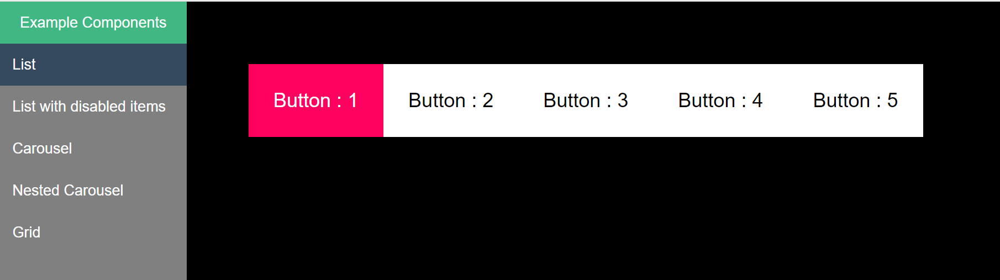
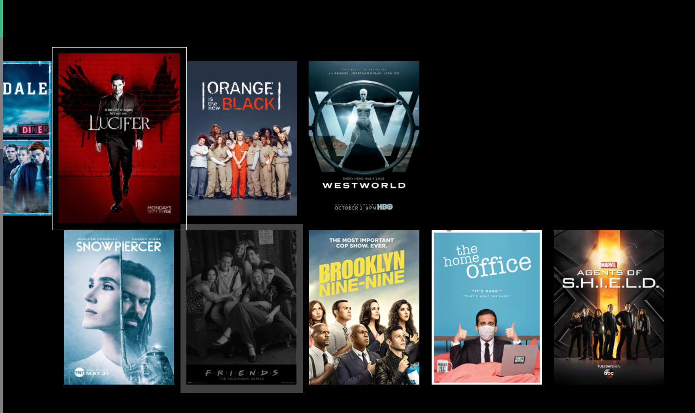

# vue-spatial-navigation

## Demo
Check out the demo here
https://vue-spatial-navigation.herokuapp.com/list

## Screenshots

<div>



</div>

## Project setup

```
npm install
```

### Compiles and hot-reloads for development

```
npm run serve
```

### Compiles and minifies for production

```
npm run build
```

### Lints and fixes files

```
npm run lint
```

### Customize configuration

See [Configuration Reference](https://cli.vuejs.org/config/).
